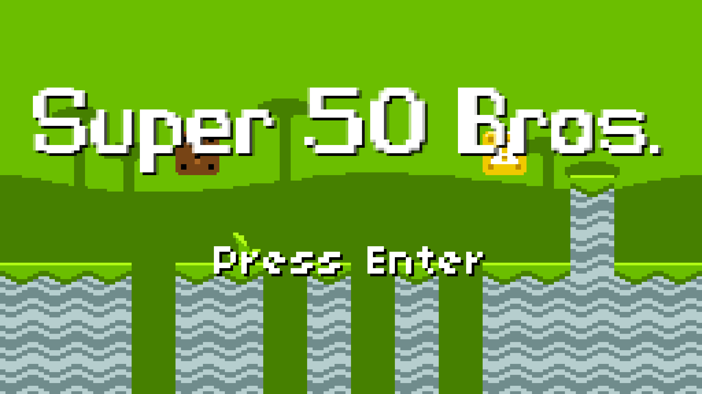
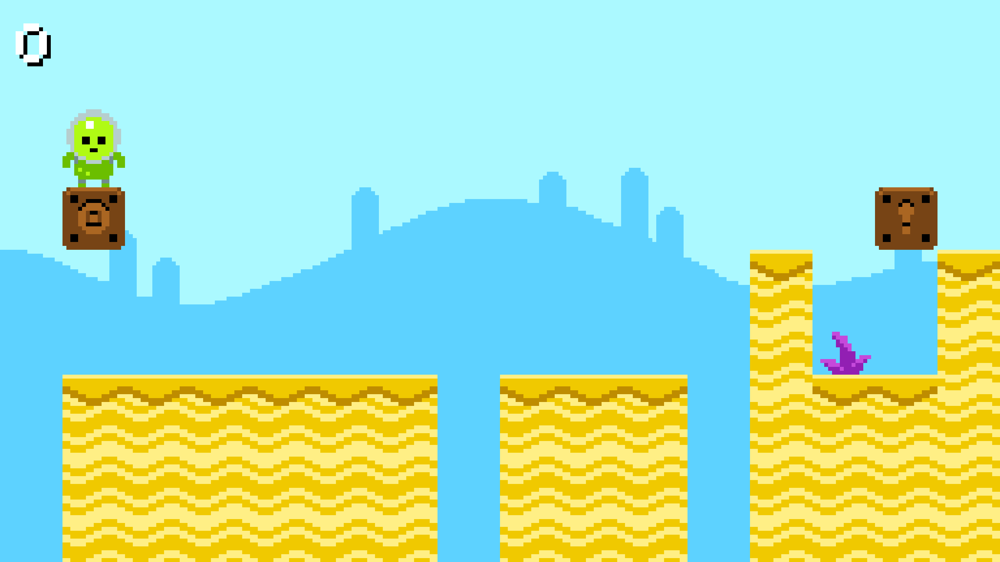

# Super 50 Mario

Super 50 Mario assignment 4 from CS50G

Original code [by Colton Ogden](https://cs50.harvard.edu/games/2018/projects/4/mario/)

Assignment:

1. ~~When the player is dropped into the level, ensure they’re always above solid ground.~~
2. Generate a random-colored key and lock block. The key should unlock the block when the player collides with it, triggering the block to disappear.
3. Once the lock has disappeared, trigger a goal post to spawn at the end of the level.
4. When the player touches this goal post, regenerate the level, and restart. The new level should be a little longer than before. 

# Playing

Keys:

* *space*: Jump
* *left*, *right*, *up*, *down* arrows: Move player
* *escape*: Quit game
* *m*: Toggle Music on or off
* *x*: (Debug mode only) Reset the level
* *s*: (Debug mode only) Take a screenshot. Location of file is printed to the console

# Screenshots

# Bugs and Notes

* Debug mode is turned on by setting `DEBUG_MODE` to `true` in [main.lua](main.lua)

# Credits

* Most of this code was written [by Colton Ogden](https://cs50.harvard.edu/games/2018/projects/4/mario/) for the [CS50G EdX course](https://learning.edx.org/course/course-v1:HarvardX+CS50G+Games/home)
* Using [boon](https://github.com/camchenry/boon) to package releases
* Additional sound effects created with [Bfxr](https://www.bfxr.net/), and from [OpenGameArt](https://opengameart.org/content/achievement)
